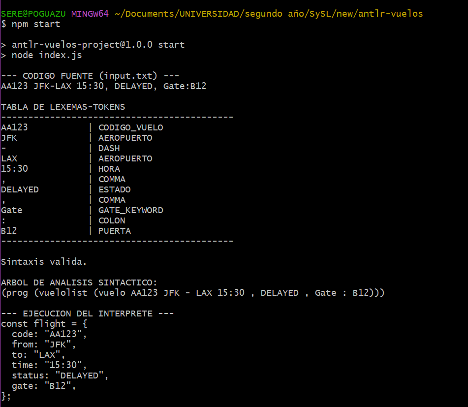
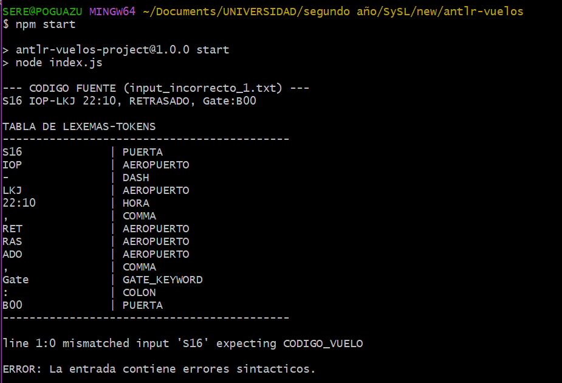
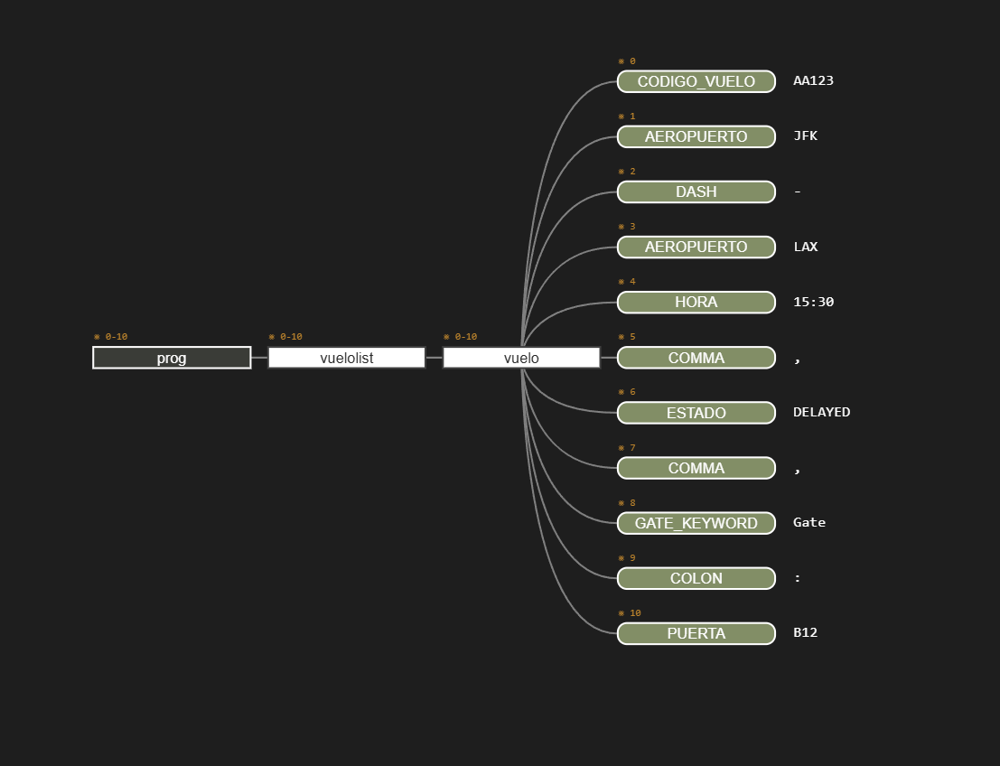

# Analizador de lenguaje "Vuelos"

Este proyecto implementa un analizador lexico, sintactico e interprete para un lenguaje de registro de vuelos definido en notacion EBNF, utilizando ANTLR4 y JavaScript sobre Node.js. El desarrollo sigue los lineamientos de la Guia de Estudio de la asignatura.

## Instalacion

### 1. Clonar el repositorio
Para obtener una copia local del proyecto, ejecuta el siguiente comando en tu terminal:

```
git clone https://github.com/serenabp/53308
```

### 2. Navegar al directorio
Accede a la carpeta raiz donde se encuentran los archivos fuente del proyecto:

```
cd 53308/antlr-vuelos
```

### 3. Instalar las dependencias
Descarga el entorno de ejecucion de ANTLR4 para JavaScript necesario para que el proyecto funcione:

```
npm install
```

## Instrucciones de uso

### 1. Preparar la entrada
El analizador procesa el codigo fuente desde el archivo input.txt. Asegurate de que este archivo exista en la raiz del proyecto. El lenguaje requiere un formato especifico de registro que incluye codigo de vuelo, aeropuertos y hora de manera obligatoria, permitiendo estado y puerta de forma opcional. Ejemplo:

    AA123 JFK-LAX 15:30, DELAYED, Gate: B12

### 2. Ejecutar el proyecto
Para iniciar el proceso de analisis e interpretacion, ejecuta el comando configurado en el package.json:

    npm start

## Resultados del analisis

### Salida correcta


### Salida incorrecta


### Árbol de derivación


## Tareas realizadas por el analizador

De acuerdo a la consigna y las pautas de trabajo, el programa realiza lo siguiente:

1. Analisis Lexico y Sintactico: Valida el codigo fuente e informa si la entrada es correcta. En caso de error, detalla la linea y la causa del problema.
2. Tabla de Lexemas-Tokens: Genera una visualizacion en consola con cada lexema reconocido y su respectivo token mapeado desde la gramatica (ej. CODIGO_VUELO, AEROPUERTO, DASH, HORA, ESTADO, PUERTA).
3. Arbol de Analisis Sintactico: Construye y muestra la estructura jerarquica del codigo en formato de texto (Parse Tree).
4. Interpretacion: Traduce el codigo fuente al lenguaje JavaScript y lo ejecuta simulando un interprete basico utilizando un patron Visitor.

## Estructura del repositorio

* vuelos.g4: Definicion de la gramatica (Lexer y Parser) basada en la EBNF asignada, separando explicitamente las reglas sintacticas de los tokens lexicos.
* index.js: Punto de entrada que coordina el flujo de datos entre el Lexer, el Parser, la impresion de reportes y el archivo de entrada.
* CustomVuelosVisitor.js: Clase que hereda de vuelosVisitor para implementar la logica semantica de traduccion a objetos JavaScript y simulacion de ejecucion.
* input.txt: Archivo de entrada actual con el codigo fuente a analizar.
* gramatica.txt: Copia en formato de texto plano con la especificacion de la gramatica asignada.
* input_correcto_1.txt / input_correcto_2.txt: Ejemplos de entrada usados como casos de prueba para reconocimiento correcto.
* input_incorrecto_1.txt / input_incorrecto_2.txt: Ejemplos de entrada usados como casos de prueba para reconocimiento incorrecto.